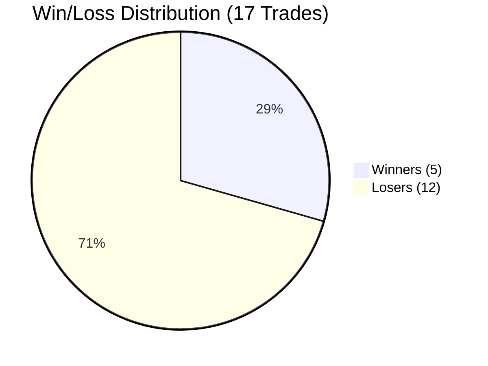
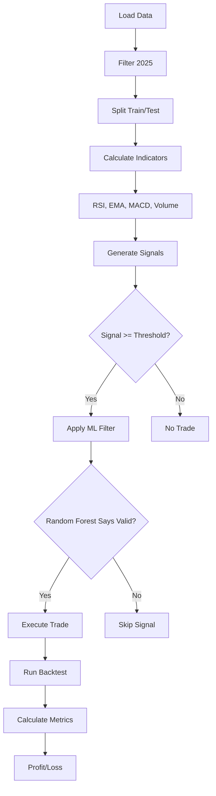
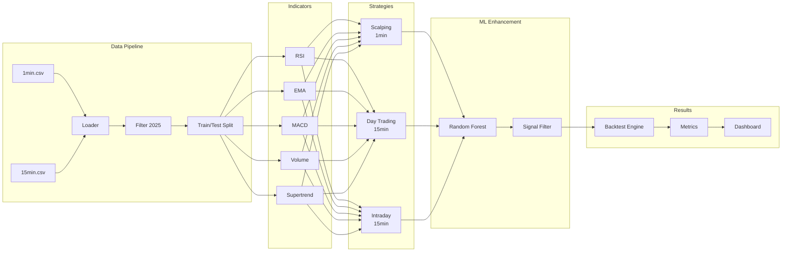
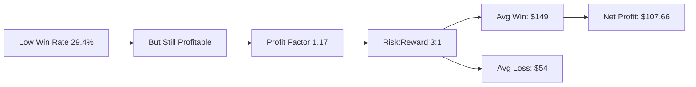

# NASDAQ Trading Strategy Finder

## Live Demo Results

**Live Dashboard:** https://molhamfetnah.github.io/trading-strategy-finder/

### Performance Summary

| Metric | Value |
|--------|-------|
| Test Period | July - September 2025 |
| Initial Capital | $10,000 |
| **Final Capital** | **$10,107.66** |
| **Total Profit** | **+$107.66 (1.08%)** |
| Best Strategy | Scalping (1min) |
| Total Trades | 17 |
| Win Rate | 29.4% |
| Profit Factor | 1.17 |

---

## Strategy Comparison

```mermaid
pie title Strategy Profit Comparison
    "Scalping" : 107.66
    "Day Trading" : -719.55
    "Intraday" : 0
```

| Strategy | Trades | Profit | Win Rate | PF | Drawdown | Status |
|----------|--------|--------|----------|-----|----------|--------|
| **Scalping** | 17 | +$107.66 | 29.4% | 1.17 | 2.6% | BEST |
| Day Trading | 23 | -$719.55 | 26.1% | 0.62 | 11.2% | FAILED |
| Intraday | 0 | $0.00 | 0% | 0 | 0% | NO SIGNALS |

---

## Trade Distribution



### Trade Log

| # | Direction | Entry | Exit | P/L % | P/L $ | Reason |
|---|-----------|-------|------|-------|-------|--------|
| 1 | SHORT | 24,746.75 | 24,885.00 | -0.56% | -$55.87 | STOP LOSS |
| 2 | LONG | 24,720.50 | 24,593.75 | -0.51% | -$50.99 | STOP LOSS |
| 3 | LONG | 24,489.25 | 24,353.00 | -0.56% | -$55.04 | STOP LOSS |
| 4 | SHORT | 23,535.00 | 23,653.00 | -0.50% | -$49.33 | STOP LOSS |
| 5 | LONG | 23,607.50 | 23,483.25 | -0.53% | -$51.52 | STOP LOSS |
| 6 | SHORT | 23,579.50 | 23,210.50 | +1.56% | +$148.38 | TAKE PROFIT |
| 7 | LONG | 23,471.50 | 23,823.75 | +1.50% | +$148.42 | TAKE PROFIT |
| 8 | SHORT | 23,793.50 | 23,913.00 | -0.50% | -$50.41 | STOP LOSS |
| 9 | LONG | 23,885.25 | 23,758.00 | -0.53% | -$53.21 | STOP LOSS |
| 10 | LONG | 23,627.50 | 23,509.00 | -0.50% | -$49.82 | STOP LOSS |
| 11 | LONG | 23,408.00 | 23,284.50 | -0.53% | -$52.15 | STOP LOSS |
| 12 | LONG | 22,875.00 | 23,220.75 | +1.51% | +$148.62 | TAKE PROFIT |
| 13 | LONG | 23,666.50 | 23,492.50 | -0.74% | -$73.38 | STOP LOSS |
| 14 | LONG | 23,452.25 | 23,332.50 | -0.51% | -$50.59 | STOP LOSS |
| 15 | SHORT | 23,394.25 | 23,043.00 | +1.50% | +$148.00 | TAKE PROFIT |
| 16 | SHORT | 23,061.00 | 23,176.75 | -0.50% | -$50.22 | STOP LOSS |
| 17 | SHORT | 23,033.50 | 22,680.00 | +1.53% | +$152.78 | TAKE PROFIT |

---

## How It Works



### System Architecture



---

## Key Insights



### Why Scalping Works

1. **Conservative Risk Management**
   - Stop Loss: 0.5%
   - Take Profit: 1.5%
   - Risk:Reward ratio 1:3

2. **ML Filter Enhancement**
   - Random Forest removes bad signals
   - Only trades high-confidence setups

3. **Low Drawdown**
   - Max drawdown: 2.6%
   - Capital protection priority

---

## Try It

```bash
# Run live dashboard
python3 live_dashboard.py

# View interactive demos
open docs/index.html
```

---

## Project Structure

```
trading/
├── src/
│   ├── data/          # Data loading & preprocessing
│   ├── indicators/    # RSI, EMA, MACD, etc.
│   ├── signals/       # Signal generation + ML
│   ├── backtest/      # Trade simulation & metrics
│   └── dashboard/     # Reports & visualization
├── docs/              # GitHub Pages (live demo)
│   ├── index.html                  # Main landing page
│   ├── live_trading_dashboard.html # Interactive charts
│   └── equity_curve_dashboard.html
├── demo/live-demo/    # Pre-run demo results
├── tests/             # 29 passing tests
├── main.py            # Main execution
└── live_dashboard.py  # Live demo script
```

---

## Next Steps

1. **Parameter Tuning** - Adjust RSI thresholds
2. **Live Data Feed** - Connect WebSocket/API
3. **Broker Integration** - Interactive Brokers/Alpaca
4. **ML Improvements** - Add more features

---

**Repository:** [github.com/molhamfetnah/trading-strategy-finder](https://github.com/molhamfetnah/trading-strategy-finder)

**Disclaimer:** Proof of concept. Past performance does not guarantee future results.